# HLD & LLD — High-Level and Low-Level Design

> **📐 Flowcharts:** All flowcharts are inline **Mermaid** diagrams below each section. They render on GitHub, VS Code (Markdown Preview), and [mermaid.live](https://mermaid.live) for editing.

---

## 📋 Page properties

| Property | Value |
|----------|--------|
| **Space** | Engineering / Architecture |
| **Status** | Draft |
| **Author** | — |
| **Created** | 17 Feb 2025 |
| **Last updated** | 17 Feb 2025 |
| **Labels** | hld, lld, architecture, design, microsoft-interview |
| **Context** | Microsoft interview — system design (HLD/LLD) |

---

## 📑 On this page

- [Part 1 — High-Level Design (HLD)](#part-1--high-level-design-hld)
- [Part 2 — Key concepts (UID, Pre-URL, glossary)](#part-2--key-concepts-detailed)
- [Part 3 — Low-Level Design (LLD)](#part-3--low-level-design-lld)
- [Part 4 — Data layer: DB & Redis (why, which, when)](#part-4--data-layer-db--redis)
- [Part 5 — Flow diagrams (detailed)](#part-5--flow-diagrams-summary)
- [Part 6 — Follow-up questions (HLD & LLD)](#part-6--follow-up-questions-hld--lld)
- [Part 7 — Logic questions (HLD & LLD)](#part-7--logic-questions-hld--lld)
- [UID generation — logic and details](#214-uid-generation--logic-and-details)
- [Resumable file upload (interruption & resume)](#24-resumable-file-upload)
- [Document control](#document-control)

---

## Part 1 — High-Level Design (HLD)

### 1.1 Purpose of HLD

High-Level Design describes the **system from a bird’s-eye view**: main building blocks, how they interact, and the overall architecture. It is used for stakeholder alignment, scoping, and as input for detailed (LLD) design.

---

### 1.2 System overview

| Item | Description |
|------|-------------|
| **System name** | [Your System Name] |
| **Purpose** | [Brief description of what the system does] |
| **Users** | End users, internal services, admin, etc. |
| **Key capabilities** | Core features and outcomes |

---

### 1.3 High-level architecture

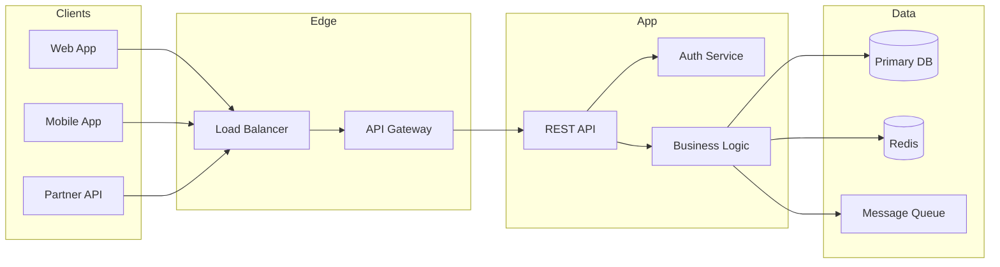

| Layer | Role |
|-------|------|
| **Clients** | Web, mobile, partners — all use Pre-URL to reach the right environment. |
| **Edge** | Load balancer + API gateway: TLS, routing, rate limit, request UID injection. |
| **Application** | REST API, auth (resolve user/session UID), business rules. |
| **Data** | Primary DB (source of truth), Redis (cache/session), queue (async jobs). |

---

### 1.4 Main components (HLD)

| Component | Responsibility |
|-----------|----------------|
| **Client / UI** | User interaction, calls APIs using base/pre-URL |
| **API Gateway** | Routing, rate limiting, SSL termination |
| **Application services** | Request handling, orchestration |
| **Business logic** | Rules, validations, workflows |
| **Data store** | Persistent storage (entities identified by UID) |
| **Cache** | Session, UID mapping, frequently used data |

---

### 1.5 High-level data flow (detailed)

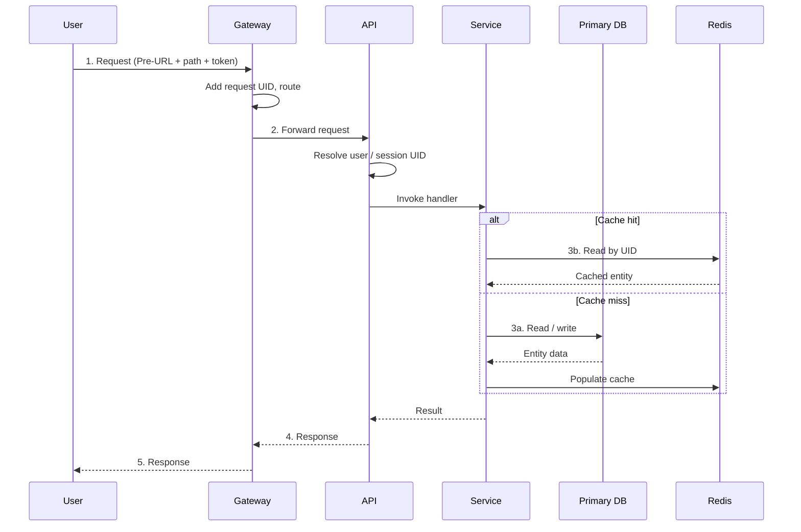

**Flow summary:** Client calls Pre-URL + path with token → Gateway adds request UID and routes → API resolves user/session UID → Service uses primary DB and Redis (by UID) → response returned.

---

### 1.6 Non-functional considerations

| Area | HLD guidance |
|------|------------------|
| **Scalability** | Horizontal scaling of stateless services; UID used for correlation and partitioning where needed. |
| **Security** | Auth tokens, UID for audit and access control; pre-URL/base-URL for correct environment routing. |
| **Availability** | Redundancy at gateway and service layer; data layer replication as per LLD. |

---

## Part 4 — Data layer: DB & Redis

*Technology choices and rationale — relevant for Microsoft interview (Azure SQL, Azure Cache for Redis, etc.).*

### 4.1 Which primary database and why

| Choice | Recommendation | Why (interview-ready answer) |
|--------|----------------|------------------------------|
| **Primary DB** | **Azure SQL Database** or **PostgreSQL** (e.g. Azure Database for PostgreSQL) | **ACID**, strong consistency for user/order data; UID as primary key; good indexing (B-tree on UID); fits Microsoft ecosystem (Azure SQL). |
| **Schema** | Relational (users, sessions, orders tables) | Relationships (user → sessions, user → orders); foreign keys; easy to reason about in LLD. |
| **Why not only NoSQL?** | NoSQL (e.g. Cosmos DB) is an option for scale-out or flexible schema, but for “which DB and why” we pick relational for core entities so we get transactions and joins. | You can say: “For core entities identified by UID I’d use Azure SQL/PostgreSQL; for high write throughput or global distribution I’d consider Cosmos DB and justify trade-offs.” |

**Summary:** Use a **relational DB (Azure SQL or PostgreSQL)** as primary store: source of truth for entities identified by UID; supports transactions, indexes on UID, and joins.

---

### 4.2 Why Redis and what for

| Use case | Why Redis | Details |
|----------|-----------|---------|
| **Session store** | Fast, in-memory; key = session UID; TTL for expiry | Store session UID → user UID, permissions; avoid hitting DB on every request. |
| **Cache by UID** | Sub-ms lookup; key = `entity_type:uid` (e.g. `user:usr_abc`) | Reduce DB load for hot entities; cache-aside pattern. |
| **Rate limiting** | Counters per client/user UID; sliding window or fixed window | API gateway or app layer can use Redis INCR + TTL. |
| **Idempotency** | Store idempotency key → response for a short TTL | Prevent duplicate processing on retries. |

**Why not only DB?** DB is for durability and consistency; Redis is for **low latency** and **high read/write throughput** for ephemeral or hot data. Together: DB = source of truth, Redis = cache/session/rate limit.

**Microsoft context:** **Azure Cache for Redis** is the managed option; same concepts (session, cache by UID, rate limit).

---

### 4.3 Data flow: DB vs Redis (when to use which)

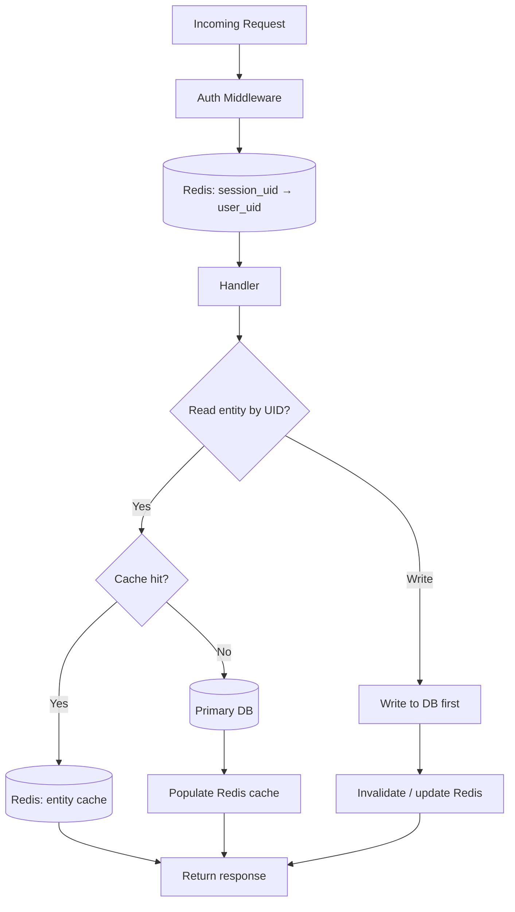

| Step | Where | Why |
|------|--------|-----|
| Resolve session | Redis (key = session_uid) | Fast; session is short-lived. |
| Read entity by UID | Redis first; on miss → DB | Reduce DB load; cache key = `user:uid`. |
| Write entity | DB first; then update/invalidate Redis | DB is source of truth; keep cache consistent. |

---

### 4.4 Technology summary (Microsoft / Azure angle)

| Component | Option | Why |
|-----------|--------|-----|
| **Primary DB** | Azure SQL Database or Azure Database for PostgreSQL | Managed, HA, backups; UID as PK; good for interview. |
| **Cache / session** | Azure Cache for Redis | Managed Redis; session store and cache by UID. |
| **API Gateway** | Azure API Management or App Gateway | Routing, rate limit, TLS; Pre-URL points here. |
| **Hosting** | Azure App Service / AKS | Stateless app tier; scale out. |

---

## Part 2 — Key concepts (detailed)

### 2.1 What is UID and why we use it

#### Definition

**UID (Unique Identifier)** is a value that **uniquely** identifies a single entity within the system (e.g. user, order, session, or resource). It is typically:

- **Globally unique** — no two entities share the same UID.
- **Stable** — does not change over the entity’s lifecycle.
- **Opaque** to the client (e.g. UUID, ULID, or internal ID).

> **ℹ️ Info**  
> UID is not the same as a database auto-increment ID. UIDs are usually generated by the application (e.g. UUID) and are safe to expose in URLs and APIs.

#### Why we use UID

| Reason | Explanation |
|--------|-------------|
| **Uniqueness** | Prevents collisions when creating users, orders, sessions, etc. |
| **Traceability** | Logs and audits can reference one UID to follow a request or entity end-to-end. |
| **Security** | Avoids exposing sequential internal IDs; UID is safer in URLs and APIs. |
| **Distribution** | Systems that span multiple DBs or services can generate UIDs without a central counter. |
| **Correlation** | Same UID (e.g. request-id or session-id) used across services for debugging and monitoring. |

#### Where UID appears

- **URLs:** `/users/{uid}`, `/orders/{order_uid}`
- **Headers:** `X-Request-Id`, `X-Session-Id`
- **Database:** Primary key or alternate key for the entity
- **Logs:** Every log line can carry UID for filtering and tracing

#### Example UID types

| Type | Example | Use |
|------|---------|-----|
| **User UID** | `usr_abc123xyz` | Identifies a user account |
| **Session UID** | `sess_xyz789` | Identifies a login/session |
| **Request UID** | UUID in `X-Request-Id` | Identifies a single API request for tracing |

---

#### 2.1.4 UID generation — logic and details

**Where UID is generated:** In the **application layer** (service that creates the entity), before or during the first write to the database. Not in the DB as auto-increment if we want a globally unique, distributable identifier.

**When it is generated:** At **entity creation time** (e.g. when creating a user, order, or session). One UID per entity; never regenerated for that entity.

**Common algorithms:**

| Algorithm | Logic | When to use |
|-----------|--------|-------------|
| **UUID v4** | 122 random bits + 6 fixed bits; format `xxxxxxxx-xxxx-4xxx-yxxx-xxxxxxxxxxxx` (hex). No coordination between servers. | General purpose; no ordering requirement; good for request/session UID. |
| **ULID** | 48-bit timestamp (ms) + 80-bit random. Lexicographically sortable by time. | When you want time-ordered UIDs (e.g. for DB index locality or listing by “created at”). |
| **Custom prefix + random** | e.g. `usr_` + 16 hex chars. Prefix identifies entity type. | Readable in logs (e.g. `usr_a1b2c3`, `ord_x9y8z7`). |

**Logic (pseudo-code):**

```
ON create_entity(type):
  1. IF type needs time-order: uid = ULID()   // e.g. 01ARZ3NDEKTSV4RRFFQ69G5FAV
  2. ELSE:                    uid = UUIDv4()  // e.g. 550e8400-e29b-41d4-a716-446655440000
  3. OPTIONAL: prefix = get_prefix(type)     // e.g. "usr", "sess"
  4. OPTIONAL: uid = prefix + "_" + strip_dashes(uid)
  5. CHECK uniqueness in DB (optional; UUID/ULID collision is negligible)
  6. RETURN uid
```

**Why no central server?** UUID v4 and ULID use enough randomness that two servers generating in parallel will not collide in practice. So we avoid a single point of failure and latency of a “UID service.”

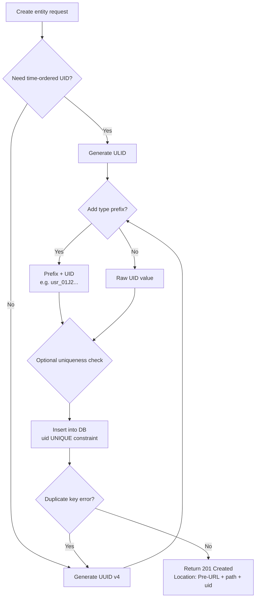

---

### 2.2 What is Pre-URL and why we need it

#### Definition

**Pre-URL** (also **base URL**, **root URL**, or **environment URL**) is the **prefix** of the full URL used to reach the system. It includes:

- **Scheme:** `https://`
- **Host:** e.g. `api.example.com`, `staging-api.example.com`
- **Optional base path:** e.g. `/v1`, `/api`

**Examples:**

| Environment | Pre-URL |
|-------------|---------|
| Production | `https://api.example.com/v1` |
| Staging / Pre-production | `https://staging-api.example.com/v1` |
| Local | `https://localhost:8443/v1` |

#### Why we need Pre-URL

| Reason | Explanation |
|--------|-------------|
| **Environment separation** | Different pre-URLs for dev, staging, pre-prod, prod so clients hit the right environment. |
| **Configuration** | Client app stores one “pre-URL”; all API calls are built as `preURL + path` (e.g. `preURL + "/users/" + uid`). |
| **Security** | Prod pre-URL is not mixed with test; credentials and data stay per environment. |
| **Testing** | QA and automation point to staging/pre-prod pre-URL without code changes. |
| **Multi-region** | Different pre-URLs per region (e.g. `api-us.example.com`, `api-eu.example.com`). |

#### How Pre-URL is used

1. **Client configuration**  
   `BASE_URL = "https://staging-api.example.com/v1"`
2. **Building requests**  
   `GET ${BASE_URL}/users/${userUid}`  
   Full URL = Pre-URL + path + query params.
3. **Server-side redirects**  
   Redirect responses use the same pre-URL (or configured base) so links point to the correct environment.

#### Pre-URL vs full URL

| Part | Example |
|------|---------|
| **Pre-URL** | `https://api.example.com/v1` |
| **Path** | `/users/usr_abc123` |
| **Full URL** | `https://api.example.com/v1/users/usr_abc123` |

> **📌 Note**  
> In Confluence you can store environment-specific Pre-URLs in a separate runbook or config page and link to it from here.

---

### 2.3 Glossary

| Term | Meaning | Why it matters |
|------|---------|----------------|
| **API key** | Secret value identifying the client/app | Used for auth and rate limiting per client. |
| **Token (JWT/OAuth)** | Short-lived credential for a user/session | Auth per request; often tied to a session UID. |
| **Endpoint** | URL path + method (e.g. `POST /orders`) | Defines what operation is performed. |
| **Idempotency key** | Client-supplied unique value for a mutation | Prevents duplicate orders/actions when retrying. |

---

### 2.4 Resumable file upload

When a **file upload is interrupted** (connection drop, timeout, device sleep), the client can **resume** from the last successfully uploaded byte instead of restarting from zero.

---

#### 2.4.1 Why uploads get interrupted

| Cause | Example |
|-------|---------|
| **Network drop** | Wi‑Fi disconnect, mobile switching towers |
| **Timeout** | Proxy or server closes long-lived connection |
| **Client closed** | User closes tab or app; device sleep |
| **Server restart** | Deployment or crash during upload |

---

#### 2.4.2 How resume works (high level)

1. **Split file into chunks** (e.g. 5–10 MB each). Each chunk has a **byte range** (start–end).
2. **Server tracks progress** per upload: an **upload ID** (UID) and which byte ranges have been received.
3. **Client sends chunks** (in order or parallel). For each chunk: send **range** (e.g. `Bytes=0-5242879`) and **upload ID**.
4. **On interruption:** Client remembers how much was sent (or asks server “what’s the next offset?”).
5. **On resume:** Client asks server for **current status** (which ranges are done), then sends only **missing chunks/ranges**.

---

#### 2.4.3 Server-side: what we store

| What | Where | Purpose |
|------|--------|---------|
| **Upload UID** | Returned at “init upload”; used in every chunk request | Ties all chunks to one logical file. |
| **File metadata** | DB or cache (keyed by upload_uid) | Filename, size, content-type, user_uid. |
| **Received ranges** | DB or blob metadata (e.g. Azure Blob “block list”) | Know which byte ranges are already stored. |
| **Temporary storage** | Blob storage (e.g. Azure Blob “blocks”) | Chunks stored until “commit” merges them into final file. |

**Commit step:** When server has received all ranges (sum of ranges = file size), it **commits** the upload (e.g. blob “put block list”) and returns the final **file UID** or URL. Until then, the upload is “in progress” and can be resumed.

---

#### 2.4.4 Client-side: resume logic

1. **Before upload:** Call `POST /uploads/init` with filename, size, optional hash → server returns **upload_uid** and optionally **chunk_size**.
2. **Upload chunks:** For each chunk, `PUT /uploads/{upload_uid}?offset=0&length=5242880` with body = chunk bytes. Store last successful offset locally (or query server).
3. **On failure:** On connection error or 5xx, **do not** discard progress. Save `last_successful_offset`.
4. **On resume:** Call `GET /uploads/{upload_uid}/status` → server returns `{ "received_ranges": [[0, 5242879], [10485760, 15728639]], "total_size": 20971520 }`. Client sends only ranges not in `received_ranges`.
5. **Complete:** When all bytes received, server commits and returns 200/201 with file UID or download URL.

---

#### 2.4.5 Flow — initial upload

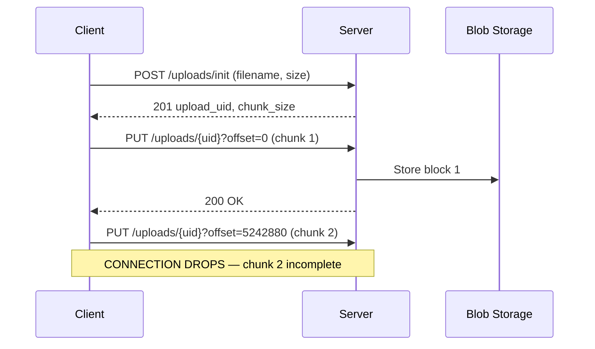

---

#### 2.4.6 Flow — after interruption: resume

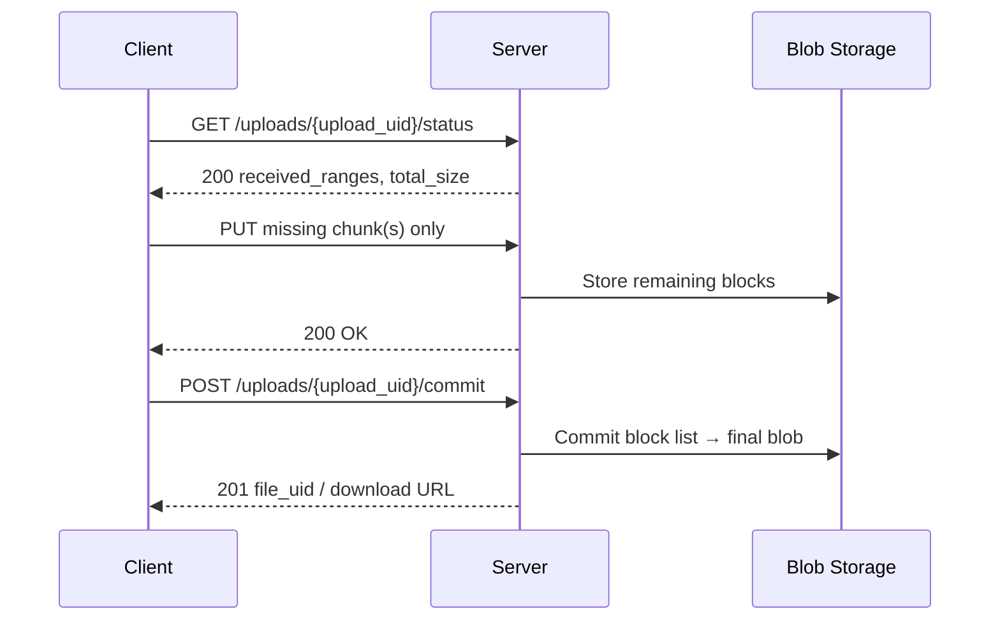

---

#### 2.4.7 Flow — decision view (when to resume vs start over)

```mermaid
flowchart TD
    A[User selects file] --> B{Have existing upload_uid?}
    B -->|Yes| C[GET /uploads/{uid}/status]
    C --> D[Upload missing ranges only]
    B -->|No| E[POST /uploads/init]
    E --> F[Upload all chunks from offset 0]
    D --> G{All bytes received?}
    F --> G
    G -->|No| H[Save last successful offset<br/>Retry on reconnect]
    H --> C
    G -->|Yes| I[POST /uploads/{uid}/commit]
    I --> J[Return file_uid / download URL]
```

---

#### 2.4.8 Other details

| Topic | Detail |
|-------|--------|
| **Chunk size** | Typically 5–10 MB. Larger = fewer requests but more lost on interrupt; smaller = more overhead. |
| **Checksum** | Optional: send hash per chunk (e.g. MD5/SHA) in header; server verifies before accepting. Reduces corruption on resume. |
| **Expiry** | Incomplete uploads (upload_uid with no commit) can be deleted after 24–48 hours to free temporary storage. |
| **Concurrency** | Multiple chunks can be sent in parallel (different offsets); server merges by range at commit. |
| **Azure** | Azure Blob “block blob” upload uses “stage block” (per chunk) + “commit block list”; same idea as above. |

---

## Part 3 — Low-Level Design (LLD)

### 3.1 Purpose of LLD

Low-Level Design breaks the HLD into **concrete modules, classes, APIs, and data flows**. It is used by developers to implement the system and by testers to design test cases.

---

### 3.2 Module breakdown

#### 3.2.1 Request handling module

| Attribute | Description |
|-----------|-------------|
| **Responsibility** | Accept HTTP request, validate headers, resolve identity (UID/session), route to correct handler. |
| **Inputs** | Full URL (Pre-URL + path); headers (e.g. `Authorization`, `X-Request-Id`, `X-Session-Id`); body (for POST/PUT/PATCH). |
| **Outputs** | Parsed path, method, query params; resolved user/session UID (if authenticated); request UID for logging. |

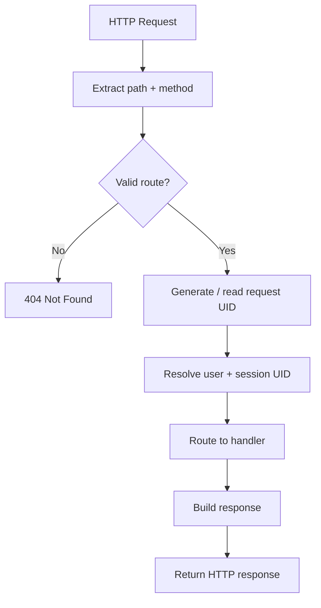

---

#### 3.2.2 Authentication module

| Attribute | Description |
|-----------|-------------|
| **Responsibility** | Validate token/API key, resolve user/session UID, attach identity to request context. |

**Steps:**

1. Read `Authorization` header or API key.
2. Validate signature/claims (e.g. JWT).
3. Extract or look up **user UID** and **session UID**.
4. Attach to request context for downstream use.

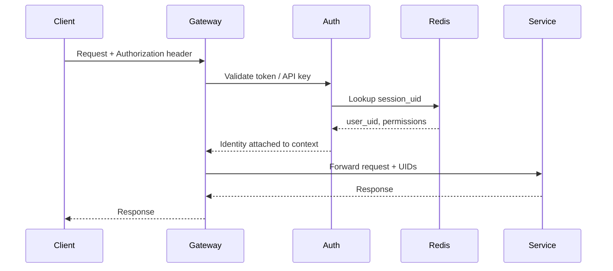

---

#### 3.2.3 Business logic module (example: user resource)

| Attribute | Description |
|-----------|-------------|
| **Responsibility** | CRUD and business rules for a resource (e.g. User) identified by UID. |

**Operations:**

- **Get by UID:** Validate requester has access, fetch by user UID, return representation.
- **Create:** Generate new UID, validate input, persist, return 201 + location using Pre-URL.
- **Update/Delete:** Resolve entity by UID, check permissions, apply change.

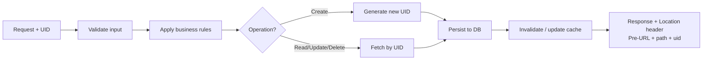

---

#### 3.2.4 Persistence module

| Attribute | Description |
|-----------|-------------|
| **Responsibility** | Store and retrieve entities by UID; use UID as primary or alternate key. |

**Design choices:**

- **UID as primary key:** e.g. `users.uid` as PK; no separate numeric ID exposed.
- **Indexes:** Index on UID for fast lookup; additional indexes for query patterns (e.g. by tenant, status).
- **Cache:** Cache key = entity type + UID (e.g. `user:usr_abc123`); TTL per entity type.

---

### 3.3 API contract (LLD)

#### URL structure

All URLs are built as: **`{Pre-URL}{/path}[/{resource_uid}]`**

| Method | URL pattern | Description |
|--------|-------------|-------------|
| GET | `{Pre-URL}/users` | List (with pagination) |
| GET | `{Pre-URL}/users/{user_uid}` | Get one user by UID |
| POST | `{Pre-URL}/users` | Create user (server assigns UID) |
| PATCH | `{Pre-URL}/users/{user_uid}` | Update by UID |
| DELETE | `{Pre-URL}/users/{user_uid}` | Delete by UID |

#### Headers

| Header | Purpose |
|--------|---------|
| `Authorization` | Bearer token or API key; used to resolve user/session UID. |
| `X-Request-Id` | Request UID for tracing (client may send; server generates if missing). |
| `X-Session-Id` | Session UID (optional; can be derived from token). |
| `Content-Type` | Request/response format (e.g. `application/json`). |

#### Response conventions

- **201 Created:** Include `Location: {Pre-URL}/resources/{new_uid}`.
- **404 Not Found:** When no resource exists for given UID.
- **403 Forbidden:** When identity (resolved from token/UID) is not allowed to access the resource.

---

### 3.4 End-to-end request flow (LLD) — detailed

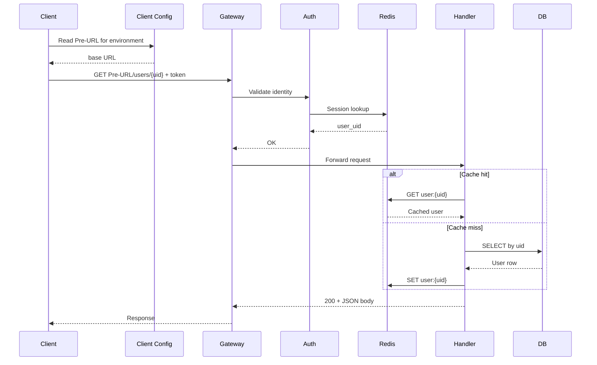

---

### 3.5 Error handling flow

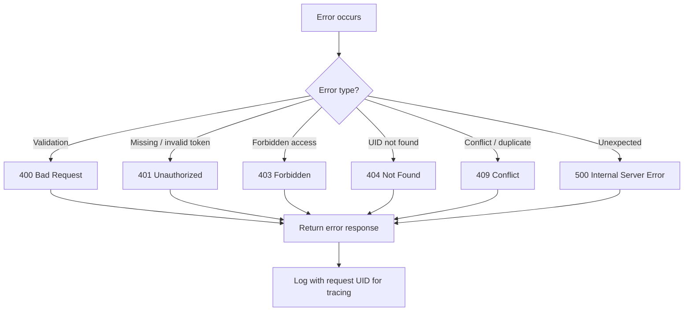

---

## Part 5 — Flow diagrams summary

### 5.1 System context (HLD) — detailed

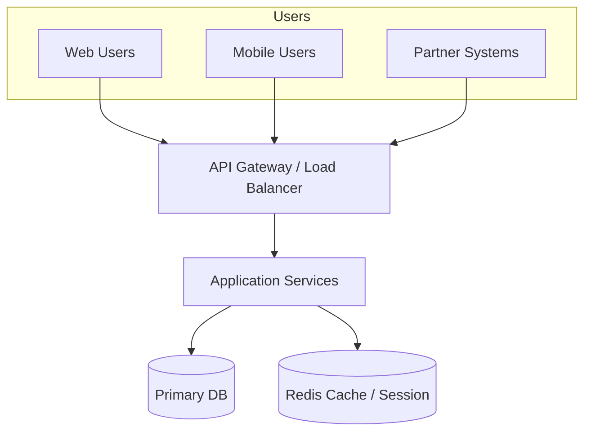

### 5.2 UID lifecycle — detailed

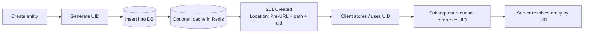

### 5.3 Pre-URL usage (client-side) — detailed

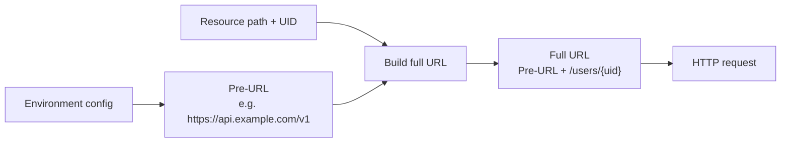

---

## Part 6 — Follow-up questions (HLD & LLD)

*Typical Microsoft interview follow-ups — use your HLD/LLD to answer.*

### 6.1 HLD follow-up questions

| # | Question | What to cover (short) |
|---|----------|------------------------|
| 1 | How would you scale this to 10x traffic? | Stateless app tier + horizontal scaling; Redis for session/cache; DB read replicas; partition by UID if needed. |
| 2 | How do you ensure high availability? | Multi-AZ / multi-region for gateway and app; DB replication (primary + replica); Redis cluster; health checks and failover. |
| 3 | How would you secure the API? | TLS (Pre-URL is HTTPS); auth (token → user/session UID); rate limiting (e.g. Redis); audit logs with UID. |
| 4 | Why use a gateway instead of clients calling services directly? | Single entry point; TLS termination; rate limit; request UID; routing by path/Pre-URL. |
| 5 | How do you handle different environments (dev/staging/prod)? | Different Pre-URL per environment; same code, config-driven base URL. |
| 6 | When would you add a message queue? | Async processing (e.g. send email, update caches); decouple producer/consumer; use queue for jobs keyed by UID where needed. |

### 6.2 LLD follow-up questions

| # | Question | What to cover (short) |
|---|----------|------------------------|
| 1 | How do you find a user by UID quickly? | Primary key or unique index on `uid` in DB; cache in Redis with key `user:{uid}` and TTL. |
| 2 | How do you avoid duplicate creation (e.g. double submit)? | Idempotency key in request; store in Redis (key → response) for TTL; return cached response on replay. |
| 3 | How do you invalidate cache when data changes? | On write: update DB then delete or update Redis key for that UID (cache-aside invalidation). |
| 4 | Why put session in Redis and not DB? | Low latency; TTL for expiry; high read volume per request; DB for durable data only. |
| 5 | How do you trace a request across services? | Pass and log `X-Request-Id` (request UID) in headers; correlate logs by this UID. |
| 6 | How do you design the `users` table for UID? | Column `uid` (e.g. UUID/ULID) as primary key; index on UID; optional secondary indexes (e.g. email, tenant_id). |

---

## Part 7 — Logic questions (HLD & LLD)

*Conceptual and small design puzzles — practice explaining trade-offs.*

### 7.1 HLD logic questions

| # | Question | Intended reasoning |
|---|----------|--------------------|
| 1 | **You have 1 DB and 1 Redis. DB is the bottleneck. What do you add or change?** | Add read replicas for DB; use Redis more (cache by UID, session); move heavy reads to cache or replicas; consider partitioning by UID. |
| 2 | **Client sends the same request twice (e.g. double click). How do you make the operation safe?** | Idempotency key per request; server stores key → result in Redis; second request returns same result without re-running mutation. |
| 3 | **How would you support multiple regions (e.g. US, EU)?** | Different Pre-URL or same domain with geo-routing; data residency: DB/cache per region or replicate; UID globally unique so same UID works everywhere. |
| 4 | **Why not store everything in Redis?** | Redis is in-memory, volatile; DB gives durability, consistency, and larger storage; use Redis for cache/session, DB for source of truth. |
| 5 | **Traffic is spiky. How do you design for bursts?** | Auto-scaling app tier; queue to smooth writes; Redis to absorb read spikes; rate limiting to protect DB and backend. |

### 7.2 LLD logic questions

| # | Question | Intended reasoning |
|---|----------|--------------------|
| 1 | **Design a rate limiter: N requests per minute per user.** | Key = `ratelimit:{user_uid}` in Redis; INCR + EXPIRE (or sliding window); if count > N return 429; optionally do at gateway. |
| 2 | **How do you generate UIDs so two servers don’t create the same UID?** | UUID v4 (random) or ULID; no coordination needed; or DB sequence/identity if single writer and UID is not exposed. |
| 3 | **GET /users/{uid} returns stale data after an update. Why and how to fix?** | Cache not invalidated on update; on PATCH/PUT/DELETE for that UID, invalidate or update Redis key so next GET hits DB or refreshed cache. |
| 4 | **You need to list “all orders for user X” and “get order by UID.” How do you index?** | Primary/unique index on `order_uid`; secondary index on `user_uid` (or composite user_uid + created_at) for list; cache hot orders by order_uid in Redis. |
| 5 | **Session expires mid-request. What should the API return and where?** | Auth middleware resolves session_uid from token; if Redis returns nil or expired, return 401 Unauthorized with clear message; client re-auth and retry. |

---

## Document control

| Version | Date | Author | Changes |
|---------|------|--------|---------|
| 1.4 | 2025-06-28 | — | Replaced Excalidraw links with inline Mermaid flow diagrams |
| 1.3 | 2025-02-17 | — | All flowcharts moved to Excalidraw (HLD-LLD-diagrams folder); Mermaid/ASCII replaced with Excalidraw links |
| 1.2 | 2025-02-17 | — | UID generation logic; resumable file upload; ASCII flow diagrams |
| 1.1 | 2025-02-17 | — | Prettier flowcharts; Data layer (DB, Redis); Microsoft interview; follow-up & logic questions |
| 1.0 | 2025-02-17 | — | Initial HLD + LLD; Confluence-style; UID/Pre-URL |

---

> **💡 Confluence / GitHub:** Mermaid diagrams render natively on GitHub. For Confluence, paste into a Mermaid macro or export PNG from [mermaid.live](https://mermaid.live).  
> **🎯 Microsoft interview:** Use Part 4 (DB/Redis), Part 6 (follow-ups), and Part 7 (logic) to practice explaining your design and trade-offs.

How UID is generated
Use a collision-resistant algorithm in the app/service layer:
UUID v4 (random) for general purpose, or
ULID (timestamp + random) if you want time-sortable IDs.
Optionally add a type prefix for readability: usr_, sess_, upl_, fil_.
Example: usr_01J2... (ULID) or usr_550e8400e29b... (UUIDv4 without dashes)
How it guarantees “no duplicates”
It’s a two-layer guarantee:
Layer 1 (practical uniqueness): UUIDv4/ULID have an astronomically low collision probability, even across many servers.
Layer 2 (hard guarantee in DB): the database column uid has a UNIQUE constraint / UNIQUE index.
If a collision ever happens, the insert fails with a “duplicate key” error.
The service then generates a new UID and retries.
So: algorithm makes collisions extremely unlikely, and the DB unique index makes duplicates impossible to store.
