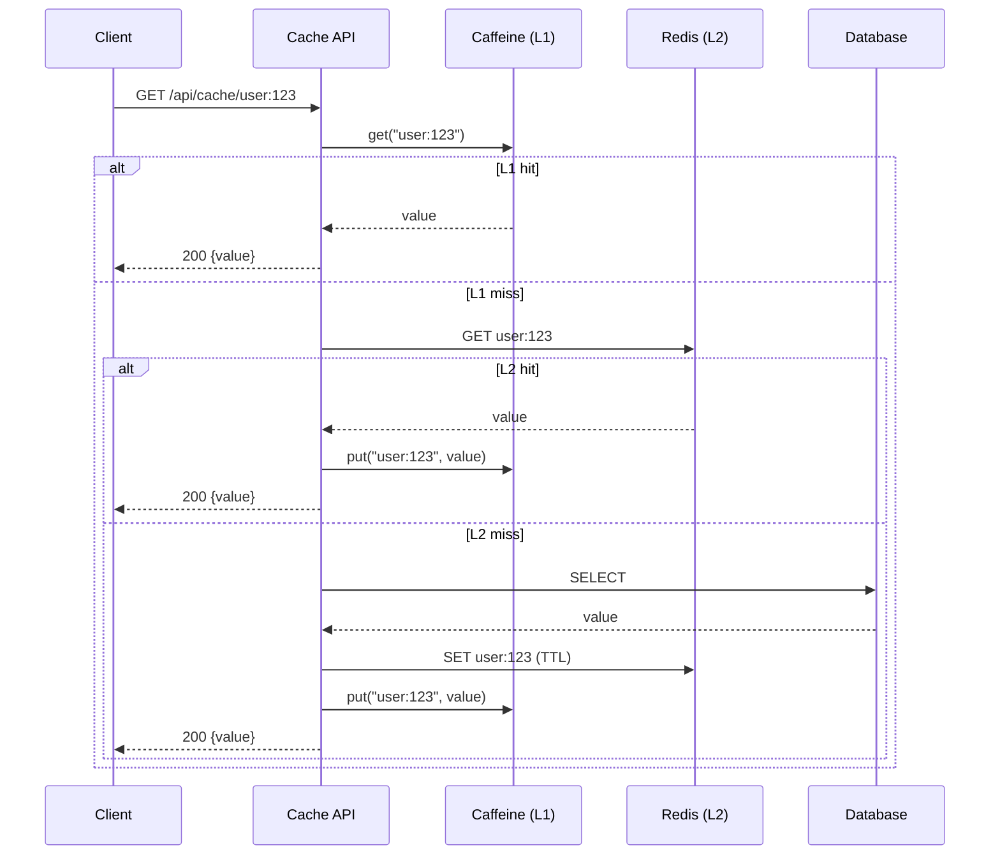

# Distributed Cache - API Flow & Step-by-Step Guide

## Design: Cache-Aside Pattern

| Method | Endpoint | Description |
|--------|----------|-------------|
| GET | `/api/cache/{key}` | Get value (L1 → L2 → DB) |
| PUT | `/api/cache/{key}` | Set value (L1 + L2) |
| DELETE | `/api/cache/{key}` | Invalidate (L1 + L2) |

## Request Flow - GET (Cache-Aside)

## Step-by-Step GET Flow

| Step | Component | Action |
|------|-----------|--------|
| 1 | Client | GET /cache/{key} |
| 2 | CacheService | L1 (Caffeine) get |
| 3 | If miss | L2 (Redis) get |
| 4 | If miss | Backend/DB load |
| 5 | Populate | SET in L2, put in L1 |
| 6 | Return | Value to client |
