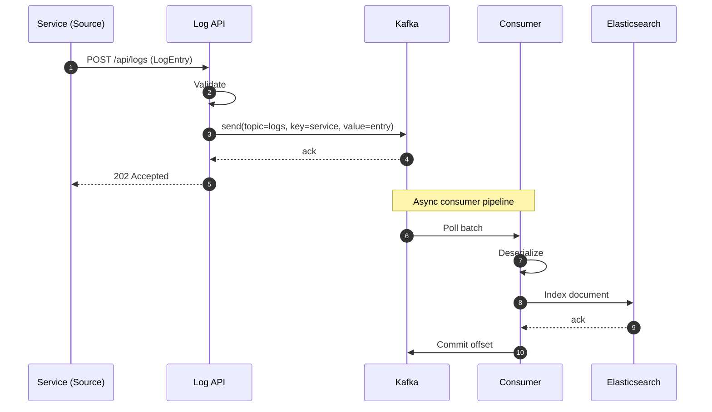
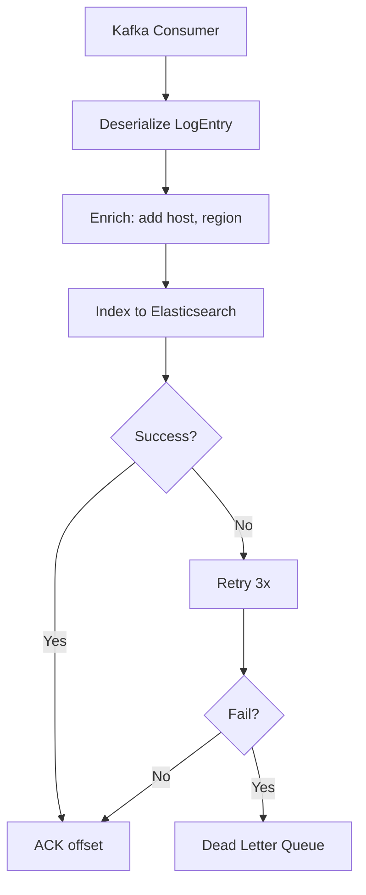

# Logging Service - API Flow & Step-by-Step Guide

## API Endpoints

| Method | Endpoint | Description |
|--------|----------|-------------|
| POST | `/api/logs` | Ingest log entry (async, returns 202) |

## Request Flow - Step by Step

### Step 1: Client Sends Log
```json
POST /api/logs
Content-Type: application/json

{
  "timestamp": 1739000000000,
  "level": "INFO",
  "service": "rate-limiter",
  "message": "Request processed successfully",
  "traceId": "abc-123",
  "metadata": {
    "userId": "u1",
    "latencyMs": 45
  }
}
```

### Step 2: Validation
```
LogController.ingest()
  ├─ @Valid → Validate request (timestamp, level, service, message required)
  └─ logIngestionService.ingest(entry)
```

### Step 3: Publish to Kafka
```
KafkaLogIngestionService.ingest()
  ├─ Kafka key = entry.service (partition by service)
  ├─ Kafka value = LogEntry JSON
  ├─ KafkaTemplate.send(topic, service, entry)
  └─ Returns immediately (async)
```

### Step 4: Response
```
Controller → 202 Accepted
Body: {"status": "accepted"}
```

## Complete Flow Diagram



## Step-by-Step Summary

| Step | Component | Action |
|------|-----------|--------|
| 1 | Source Service | POST log JSON to /api/logs |
| 2 | LogController | Validate timestamp, level, service, message |
| 3 | KafkaLogIngestionService | KafkaTemplate.send(service, entry) |
| 4 | Kafka | Partition by service_id, store |
| 5 | Controller | Return 202 immediately |
| 6 | Consumer | (Async) Consume, index to Elasticsearch |

## Log Entry Schema

| Field | Type | Required | Description |
|-------|------|----------|-------------|
| timestamp | long | Yes | Unix ms |
| level | string | Yes | INFO, WARN, ERROR, DEBUG |
| service | string | Yes | Service name (partition key) |
| message | string | Yes | Log message |
| traceId | string | No | Distributed tracing ID |
| metadata | object | No | Additional key-value pairs |

## Partitioning Strategy

```
Kafka topic: logs
Partition key: service
→ Logs from same service go to same partition
→ Maintains order per service
→ Enables parallel consumption by service
```

## Downstream Consumer Flow


