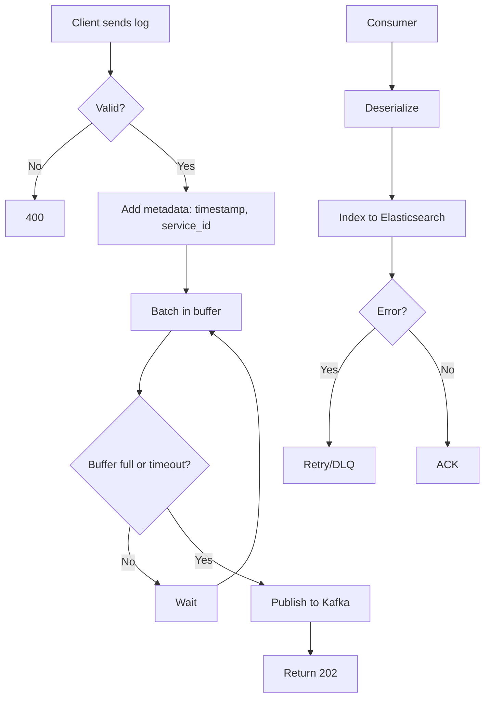

# Logging Service - High Level Design

## Overview

Centralized log aggregation for **millions of events per second**. Collects logs from distributed services, persists to storage, enables search and analytics.

## Architecture

```
┌─────────────┐ ┌─────────────┐ ┌─────────────┐     ┌─────────────────────┐
│  Service A  │ │  Service B  │ │  Service C  │     │   Log Ingestion API   │
│  (SDK/Agent)│ │             │ │             │────▶│   - Validate          │
└─────────────┘ └─────────────┘ └─────────────┘     │   - Batch & Publish   │
                                                   └───────────┬───────────┘
                                                               │
                                                               ▼
                                                    ┌─────────────────────┐
                                                    │  Kafka (logs topic)  │
                                                    │ 分区: service_id      │
                                                    └───────────┬───────────┘
                                                               │
                                    ┌──────────────────────────┼──────────────────────────┐
                                    ▼                          ▼                          ▼
                            ┌───────────────┐          ┌───────────────┐          ┌───────────────┐
                            │ Log Consumer  │          │ Log Consumer  │          │ Log Consumer  │
                            │ (Elasticsearch)│          │ (S3 cold)     │          │ (Alerts)      │
                            └───────────────┘          └───────────────┘          └───────────────┘
```

## Flow Chart



## Design Decisions: Why Kafka + Elasticsearch?

| Component | Why | Why Not |
|-----------|-----|---------|
| **Kafka** | Buffers bursts, replay, partition by service | SQS: No ordering. Direct to ES: Backpressure |
| **Elasticsearch** | Full-text search, time-range queries, Kibana | Solr: Similar. Cassandra: No full-text. S3: No search |
| **Hot/Warm** | Recent in ES (7d), older to S3 | All in ES: Cost. All in S3: No search |
