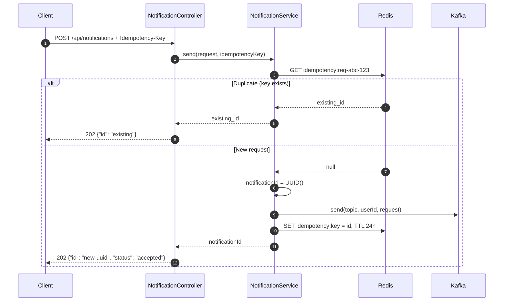
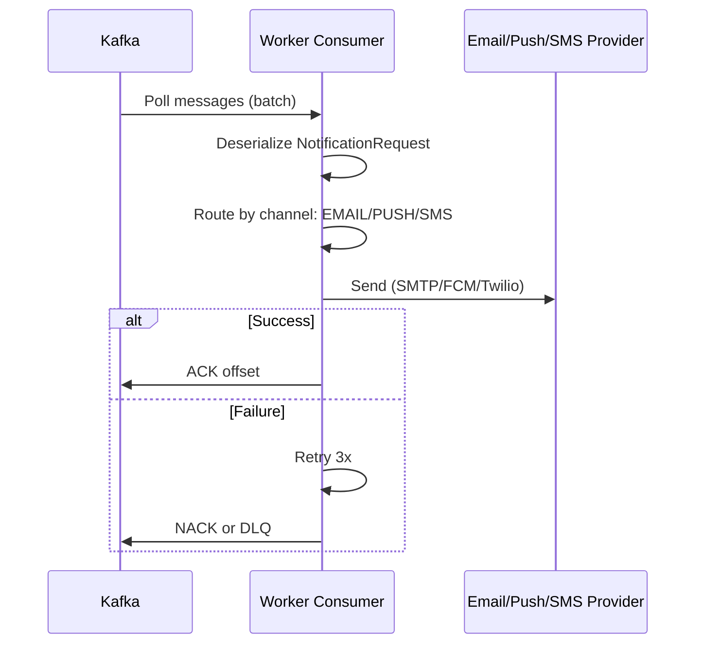

# Notification System - API Flow & Step-by-Step Guide

## API Endpoints

| Method | Endpoint | Description |
|--------|----------|-------------|
| POST | `/api/notifications` | Send notification (async, returns 202) |

## Request Flow - Step by Step

### Step 1: Client Sends Notification Request
```json
POST /api/notifications
Headers: 
  Content-Type: application/json
  Idempotency-Key: req-abc-123  (optional - prevents duplicates)

Body:
{
  "userId": "user456",
  "channel": "EMAIL",
  "title": "Order Shipped",
  "body": "Your order #1234 has shipped.",
  "email": "user@example.com",
  "metadata": { "orderId": "1234" }
}
```

### Step 2: Validation & Idempotency Check
```
NotificationController.send()
  ├─ @Valid → Validate request (userId, channel, title required)
  ├─ Extract Idempotency-Key header
  └─ notificationService.send(request, idempotencyKey)
```

### Step 3: Idempotency (Redis)
```
NotificationServiceImpl.send()
  ├─ If Idempotency-Key provided:
  │   ├─ Redis GET "idempotency:req-abc-123"
  │   ├─ If found → Return existing notification_id (no Kafka publish)
  │   └─ If not found → Continue
  └─ Generate notificationId = UUID
```

### Step 4: Publish to Kafka
```
KafkaTemplate.send(topic="notifications", key=userId, value=request)
  ├─ Partition by userId (ordering per user)
  ├─ Async send - returns immediately
  └─ Producer batches/flushes
```

### Step 5: Store Idempotency & Return
```
  ├─ Redis SET "idempotency:req-abc-123" = notificationId, TTL=24h
  └─ Return 202 Accepted, {"id": "uuid", "status": "accepted"}
```

## Complete Flow Diagram



## Consumer Flow (Background)



## Step-by-Step Summary

| Step | Component | Action |
|------|-----------|--------|
| 1 | Client | POST with JSON body, optional Idempotency-Key |
| 2 | Controller | Validate payload |
| 3 | Service | Check Redis for duplicate idempotency key |
| 4 | Service | Generate UUID if new |
| 5 | Service | KafkaProducer.send() - async |
| 6 | Service | Redis SET idempotency (24h TTL) |
| 7 | Controller | Return 202 + notification ID |
| 8 | Kafka Consumer | (Async) Consume, route by channel, send via provider |

## Channel Types

| Channel | Required Fields | Provider |
|---------|-----------------|----------|
| EMAIL | email, title, body | SMTP / AWS SES |
| PUSH | title, body (device token in metadata) | FCM / APNs |
| SMS | phone, body | Twilio / SNS |

## Request/Response Examples

### Success (New)
```bash
curl -X POST http://localhost:8081/api/notifications \
  -H "Content-Type: application/json" \
  -H "Idempotency-Key: order-123-shipped" \
  -d '{"userId":"u1","channel":"EMAIL","title":"Shipped","body":"Order shipped","email":"u@ex.com"}'
```
Response: `202 Accepted`  
`{"id":"a1b2c3d4-...","status":"accepted"}`

### Success (Duplicate - same Idempotency-Key)
Response: `202 Accepted`  
`{"id":"a1b2c3d4-..."}` (same id as first request)
