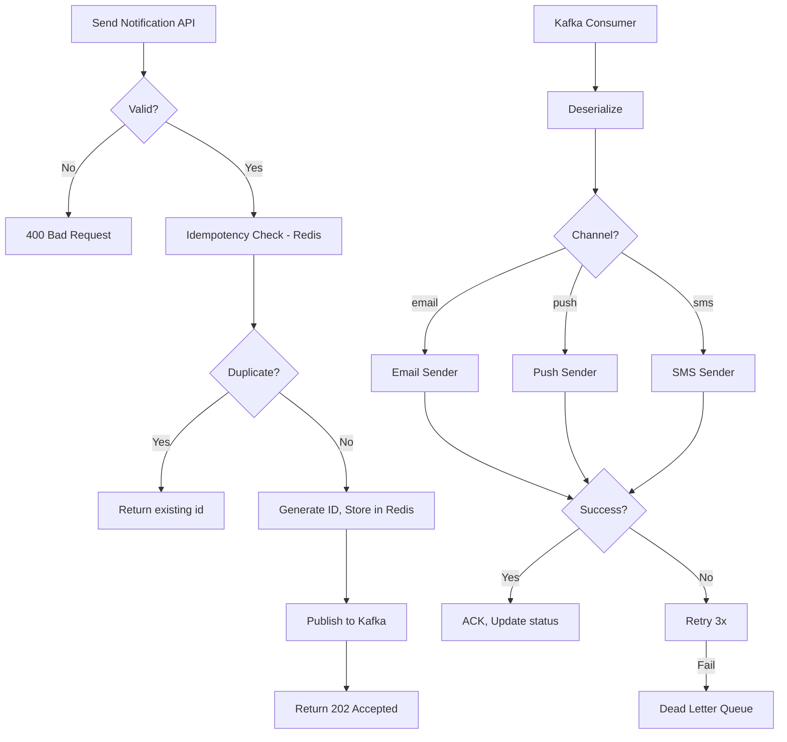

# Notification System - High Level Design

## Overview

A distributed notification system supporting **Push, Email, SMS** channels. Designed for **billions of notifications** with 99.9% delivery, idempotency, and dead-letter handling.

## Architecture

```
┌─────────────┐     ┌─────────────┐     ┌──────────────────────────────────┐
│   Clients   │────▶│  API Gateway│────▶│     Notification Service          │
│  (Mobile,   │     │  + Auth     │     │  - Validate, Dedupe, Enrich       │
│   Web)      │     └─────────────┘     │  - Publish to Kafka               │
└─────────────┘                        └──────────────┬─────────────────────┘
                                                      │
                                                      ▼
                                            ┌─────────────────┐
                                            │ Kafka Topic      │
                                            │ notifications   │
                                            │ (partitioned by │
                                            │  user_id)       │
                                            └────────┬────────┘
                                                      │
                    ┌─────────────────────────────────┼─────────────────────────────────┐
                    ▼                                 ▼                                 ▼
            ┌───────────────┐               ┌───────────────┐               ┌───────────────┐
            │ Email Worker  │               │ Push Worker   │               │ SMS Worker    │
            │ Consumer      │               │ Consumer      │               │ Consumer      │
            └───────┬───────┘               └───────┬───────┘               └───────┬───────┘
                    │                               │                               │
                    ▼                               ▼                               ▼
            ┌───────────────┐               ┌───────────────┐               ┌───────────────┐
            │ SMTP / SES    │               │ FCM / APNs    │               │ Twilio / SNS  │
            └───────────────┘               └───────────────┘               └───────────────┘
```

## Flow Chart



## Design Decisions: Why Kafka vs SQS vs RabbitMQ

| Aspect | Kafka | SQS | RabbitMQ |
|--------|-------|-----|----------|
| **Throughput** | Millions/sec | 3000/sec (standard) | ~50K/sec |
| **Ordering** | Per-partition | No | Per-queue |
| **Retention** | 7 days | 14 days | Until consumed |
| **Use case** | Event streaming, replay | Simple queue | Complex routing |
| **Why chosen** | Scale, replay, partitioning | - | - |

**Why Kafka**: Billions of notifications need partitioning by user_id for ordering. Replay for failed batches. High throughput.

**Why NOT SQS**: Lower throughput, no partitioning. Good for simpler workflows.

**Why NOT RabbitMQ**: Complex topology, lower scale. Good for complex routing.

## Edge Cases

| Edge Case | Handling |
|-----------|----------|
| Duplicate (same idempotency key) | Redis check, return existing |
| User opted out | Check preferences before send |
| Provider rate limit | Backoff, retry with exponential decay |
| Provider down | Dead letter, alert, manual retry |
| Malformed payload | Validate, reject with 400 |
| User deleted | Idempotent - skip gracefully |
