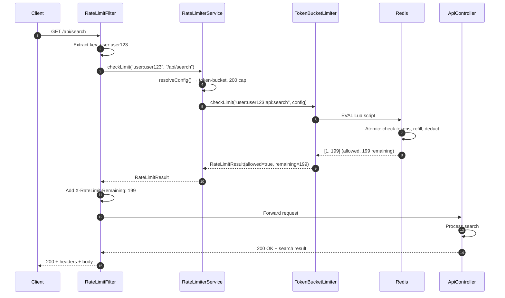
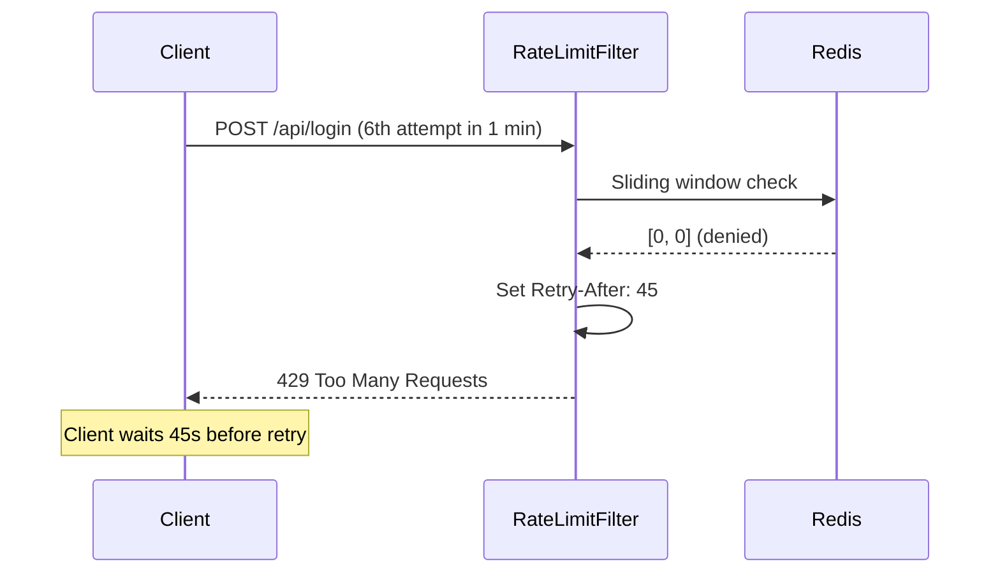
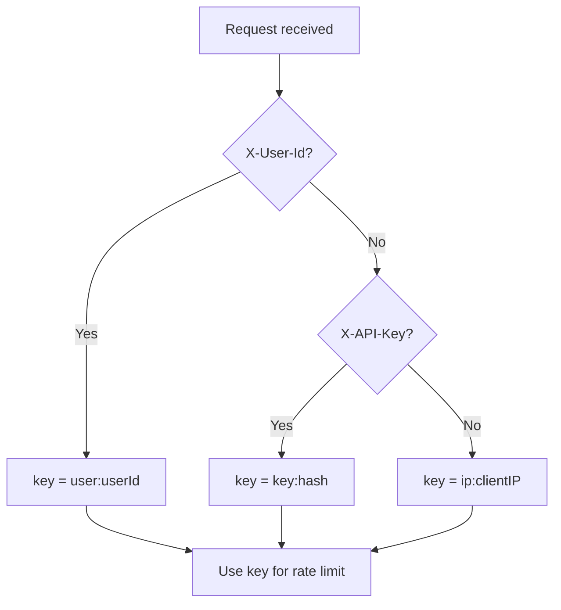

# Rate Limiter - API Flow & Step-by-Step Guide

## API Endpoints

| Method | Endpoint | Description | Rate Limit |
|--------|----------|-------------|------------|
| GET | `/api/search` | Search API | 200 req/min (token bucket) |
| POST | `/api/login` | Login | 5 req/min (sliding window) |
| POST | `/api/register` | Registration | 3 req/hour (sliding window) |

## Request Flow - Step by Step

### Step 1: Client Sends Request
```
Client → HTTP GET /api/search
Headers: X-User-Id: user123 (optional)
         X-API-Key: abc123 (optional)
         If neither: identified by IP
```

### Step 2: Rate Limit Filter Intercepts
```
RateLimitFilter.doFilterInternal()
  ├─ Extract client identifier:
  │   ├─ X-User-Id present? → key = "user:user123"
  │   ├─ X-API-Key present? → key = "key:hash(abc123)"
  │   └─ Else → key = "ip:192.168.1.1"
  ├─ Extract path: /api/search
  └─ Call RateLimiterService.checkLimit(clientId, path)
```

### Step 3: Resolve Configuration
```
RateLimiterService.resolveConfig("/api/search")
  ├─ Match endpoints (longest match first):
  │   ├─ /api/login? No
  │   ├─ /api/register? No
  │   ├─ /api/search? Yes! → config: 20 TPS, capacity 200
  │   └─ /api/*? Fallback
  └─ Return EndpointConfig
```

### Step 4: Select Algorithm & Execute
```
RateLimiterService.checkLimit()
  ├─ Algorithm: token-bucket (from config)
  ├─ Full key: "user:user123:api:search"
  └─ TokenBucketRateLimiter.checkLimit(key, config)
```

### Step 5: Redis Lua Script (Atomic)
```
TokenBucketRateLimiter → Redis
  ├─ KEYS[1] = "rl:user:user123:api:search:tb"
  ├─ KEYS[2] = "rl:user:user123:api:search:tb:ts"
  ├─ ARGV = [capacity=200, refill=20, now, ttl=60000]
  │
  └─ Lua execution:
      1. GET tokens (or default to capacity)
      2. GET last_refill timestamp
      3. elapsed = now - last_refill
      4. tokens = min(capacity, tokens + elapsed × refill_rate)
      5. if tokens >= 1:
           tokens -= 1
           SET tokens, SET timestamp (with TTL)
           return [1, remaining]  ← ALLOWED
         else:
           return [0, 0]  ← DENIED
```

### Step 6: Response Path
```
RateLimitFilter receives result
  ├─ If ALLOWED:
  │   ├─ Set header: X-RateLimit-Remaining = remaining
  │   ├─ Set header: X-RateLimit-Reset = Unix timestamp
  │   └─ filterChain.doFilter() → Forward to Controller
  │
  └─ If DENIED:
      ├─ HTTP 429 Too Many Requests
      ├─ Header: Retry-After = seconds
      ├─ Body: {"error": "Rate limit exceeded..."}
      └─ Return (do NOT forward)
```

## Complete Flow Diagram



## Flow Diagram: 429 (Rate Limited)



## Client Identification Priority



## Headers Reference

| Header | Direction | Description |
|--------|-----------|-------------|
| `X-User-Id` | Request | Authenticated user ID (preferred) |
| `X-API-Key` | Request | API key for server-to-server |
| `X-RateLimit-Remaining` | Response | Tokens/requests left in window |
| `X-RateLimit-Reset` | Response | Unix timestamp when limit resets |
| `Retry-After` | Response (429 only) | Seconds to wait before retry |

## Example: Successful Request

```bash
# Request
curl -H "X-User-Id: user123" http://localhost:8080/api/search

# Response 200 OK
X-RateLimit-Remaining: 199
X-RateLimit-Reset: 1739004120

{"status":"ok","message":"Search result"}
```

## Example: Rate Limited

```bash
# Request (after exceeding limit)
curl -X POST http://localhost:8080/api/login

# Response 429
Retry-After: 45
X-RateLimit-Remaining: 0
X-RateLimit-Reset: 1739004180

{"error":"Rate limit exceeded. Retry after 45 seconds."}
```
