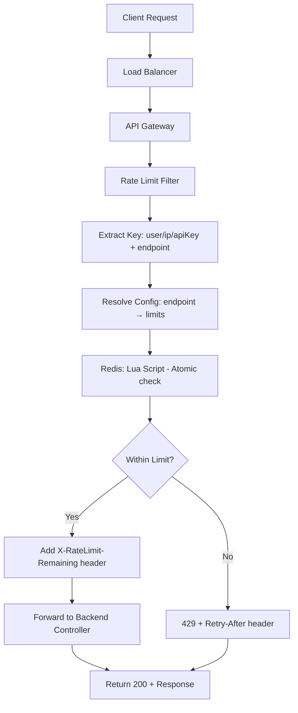

# Rate Limiter - High Level Design

## Overview

A distributed rate limiting system that protects APIs from abuse, ensures fair usage, and maintains system stability under load. Designed for **millions to billions of requests** across distributed services.

## Requirements

### Functional
- Limit requests per user/IP/API key
- Support multiple algorithms: Token Bucket, Sliding Window, Fixed Window
- Different limits per endpoint (e.g., login: 5/min, search: 100/min)
- Return clear rate limit headers (X-RateLimit-Remaining, Retry-After)

### Non-Functional
- **Latency**: < 1ms added overhead (P99)
- **Scale**: 10M+ requests/second globally
- **Consistency**: Eventually consistent across regions
- **Availability**: 99.99% - degrade gracefully if Redis fails

## Architecture

```
┌─────────────────────────────────────────────────────────────────────────────┐
│                           GLOBAL LOAD BALANCER                                │
└─────────────────────────────────────────────────────────────────────────────┘
                                      │
                    ┌─────────────────┼─────────────────┐
                    ▼                 ▼                 ▼
            ┌──────────────┐  ┌──────────────┐  ┌──────────────┐
            │   Region 1   │  │   Region 2   │  │   Region 3   │
            │  (US-East)   │  │  (EU-West)   │  │  (AP-South)  │
            └──────────────┘  └──────────────┘  └──────────────┘
                    │                 │                 │
                    ▼                 ▼                 ▼
            ┌──────────────┐  ┌──────────────┐  ┌──────────────┐
            │ API Gateway  │  │ API Gateway  │  │ API Gateway  │
            │ + Rate       │  │ + Rate       │  │ + Rate       │
            │   Limiter    │  │   Limiter    │  │   Limiter    │
            └──────┬───────┘  └──────┬───────┘  └──────┬───────┘
                   │                 │                 │
                   ▼                 ▼                 ▼
            ┌──────────────┐  ┌──────────────┐  ┌──────────────┐
            │Redis Cluster │  │Redis Cluster │  │Redis Cluster │
            │  (Local)     │  │  (Local)     │  │  (Local)     │
            └──────────────┘  └──────────────┘  └──────────────┘
                   │                 │                 │
                   └─────────────────┼─────────────────┘
                                     ▼
                            ┌──────────────┐
                            │Redis Global  │
                            │(Cross-region)│
                            └──────────────┘
```

## Flow Chart - Request Flow



## Step-by-Step Request Flow

1. **Request arrives** → RateLimitFilter intercepts (before Controller)
2. **Identity** → Extract X-User-Id, X-API-Key, or client IP
3. **Config lookup** → Match path to endpoint config (e.g. /api/login → 5/min)
4. **Algorithm** → Token bucket or sliding window based on endpoint
5. **Redis** → Single Lua script: refill tokens, deduct if allowed
6. **Response** → Allow + headers, or 429 + Retry-After

## Design Decisions

### Why Redis?
| Aspect | Decision | Why | Why Not Others |
|--------|----------|-----|----------------|
| **Storage** | Redis | O(1) atomic ops (INCR, EXPIRE), sub-millisecond latency, Lua scripts for atomic algorithms | **Memcached**: No TTL per key, no Lua. **Cassandra**: Higher latency for counters. **In-memory**: Not distributed |
| **Persistence** | Redis AOF optional | Rate limits are ephemeral; restart = reset acceptable | RDB: Less granular. Full persistence: Unnecessary overhead |
| **Topology** | Redis Cluster per region | Data locality, <1ms latency, horizontal sharding | Single node: SPOF. Replicated: Read-your-writes consistency |

### Why Token Bucket for API?
- **Burst handling**: Allows short bursts (e.g., 10 requests in 100ms) then smooth rate
- **Predictable**: Refill rate = sustained throughput
- **Industry standard**: AWS, Stripe use similar

### Why Not Fixed Window?
- **Boundary problem**: User can do 100 req at 00:59 and 100 at 01:01 = 200 in 2 seconds
- **Sliding window** fixes this but uses more memory (store timestamps)

### Sharding Strategy
- **Key**: `{region}:{user_id}:{endpoint}` 
- Ensures same user's limits hit same Redis slot within region
- Cross-region: User gets separate limits (acceptable for global fairness)

## Scalability

| Scale | Approach |
|-------|----------|
| **1M req/s** | Single Redis Cluster (50K ops/s per node × 20 nodes) |
| **10M req/s** | Per-region clusters + request coalescing |
| **100M+ req/s** | Local cache (Guava) for 95% hit + Redis for overflow, multi-region |

## Edge Cases

| Edge Case | Handling |
|-----------|----------|
| Redis unavailable | Fallback: Allow all (fail open) or deny all (fail closed) - configurable |
| Clock skew | Use Redis time, not server time for TTL |
| Key explosion | Limit key length, use hash for long user IDs |
| DDoS from new IPs | Tiered limits: IP limit (100/min) + User limit (1000/min) when authenticated |
| Token bucket edge | Use Lua script for atomic check-and-refill |

## Technology Stack

- **Runtime**: Java 17, Spring Boot 3
- **Storage**: Redis 7 (Cluster mode)
- **Algorithms**: Token Bucket, Sliding Window Log, Fixed Window
