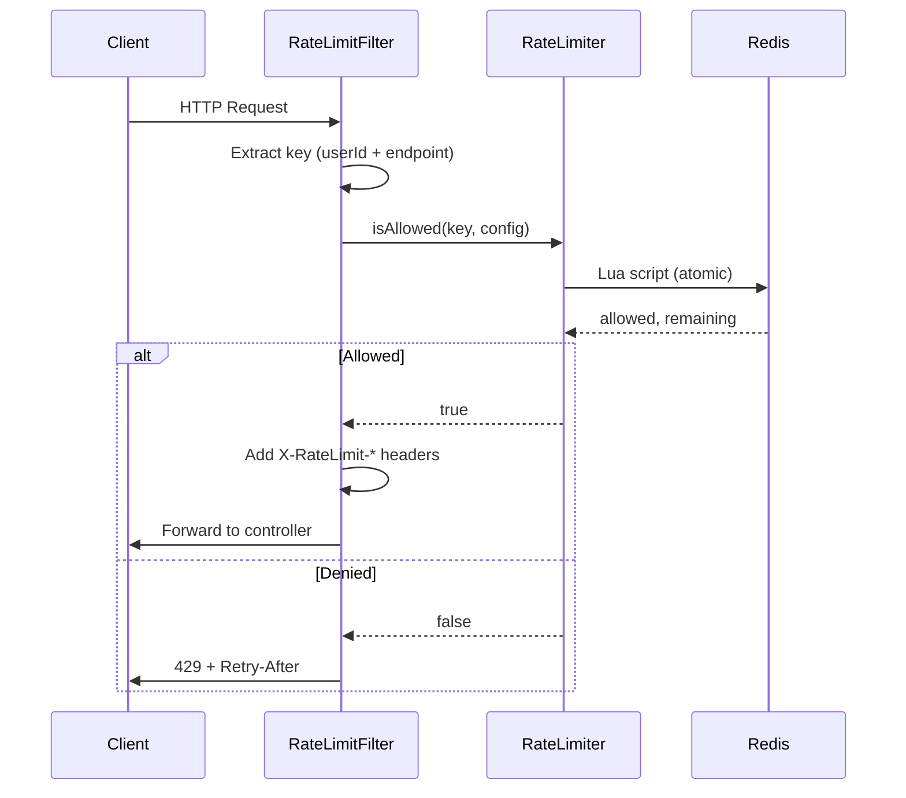

# Rate Limiter - Low Level Design

## Class Diagram

```
┌─────────────────────────────────────────────────────────────────┐
│                    <<interface>>                                 │
│                    RateLimiter                                   │
├─────────────────────────────────────────────────────────────────┤
│ + isAllowed(key: String, limit: int): boolean                    │
│ + getRemainingTokens(key: String): int                           │
│ + getRetryAfterSeconds(key: String): long                        │
└─────────────────────────────────────────────────────────────────┘
                              △
              ┌───────────────┼───────────────┐
              │               │               │
┌─────────────┴─────┐ ┌───────┴───────┐ ┌────┴─────────────┐
│ TokenBucketLimiter│ │SlidingWindow  │ │ FixedWindowLimiter│
│                   │ │Limiter        │ │                  │
└───────────────────┘ └──────────────┘ └──────────────────┘
```

## Component Flow



## Interface Design

### RateLimiter
```java
public interface RateLimiter {
    RateLimitResult checkLimit(String key, RateLimitConfig config);
}

public record RateLimitResult(
    boolean allowed,
    int remaining,
    long retryAfterSeconds,
    long resetAt
) {}
```

### Configuration (application.yml)
```yaml
rate-limiter:
  default:
    tokens-per-second: 10
    capacity: 100
  endpoints:
    /api/login:
      tokens-per-second: 1
      capacity: 5
    /api/search:
      tokens-per-second: 20
      capacity: 200
```

## Redis Key Design

| Key Pattern | TTL | Example | Purpose |
|-------------|-----|---------|---------|
| `rl:{key}:tokens` | 60s | `rl:user123:api/search:tokens` | Token bucket state |
| `rl:{key}:window` | 60s | `rl:ip1.2.3.4:api/login:window` | Sliding window timestamps |

## Lua Script - Token Bucket (Atomic)

```lua
-- KEYS[1]: key, ARGV[1]: capacity, ARGV[2]: refill_rate, ARGV[3]: now
local tokens = tonumber(redis.call('GET', KEYS[1]) or ARGV[1])
local last_refill = tonumber(redis.call('GET', KEYS[1] .. ':ts') or ARGV[3])
local now = tonumber(ARGV[3])
local refill_rate = tonumber(ARGV[2])
local capacity = tonumber(ARGV[1])

local elapsed = now - last_refill
tokens = math.min(capacity, tokens + elapsed * refill_rate)
last_refill = now

if tokens >= 1 then
    tokens = tokens - 1
    redis.call('SET', KEYS[1], tokens, 'PX', 60000)
    redis.call('SET', KEYS[1] .. ':ts', last_refill, 'PX', 60000)
    return {1, math.floor(tokens)}  -- allowed, remaining
else
    return {0, 0}  -- denied
end
```

## Error Handling

| Scenario | Action |
|----------|--------|
| Redis connection timeout | Log, allow request (fail open) |
| Redis OOM | Evict oldest keys (LRU), alert |
| Invalid key | Reject with 400 |
| Config missing | Use default, log warning |
