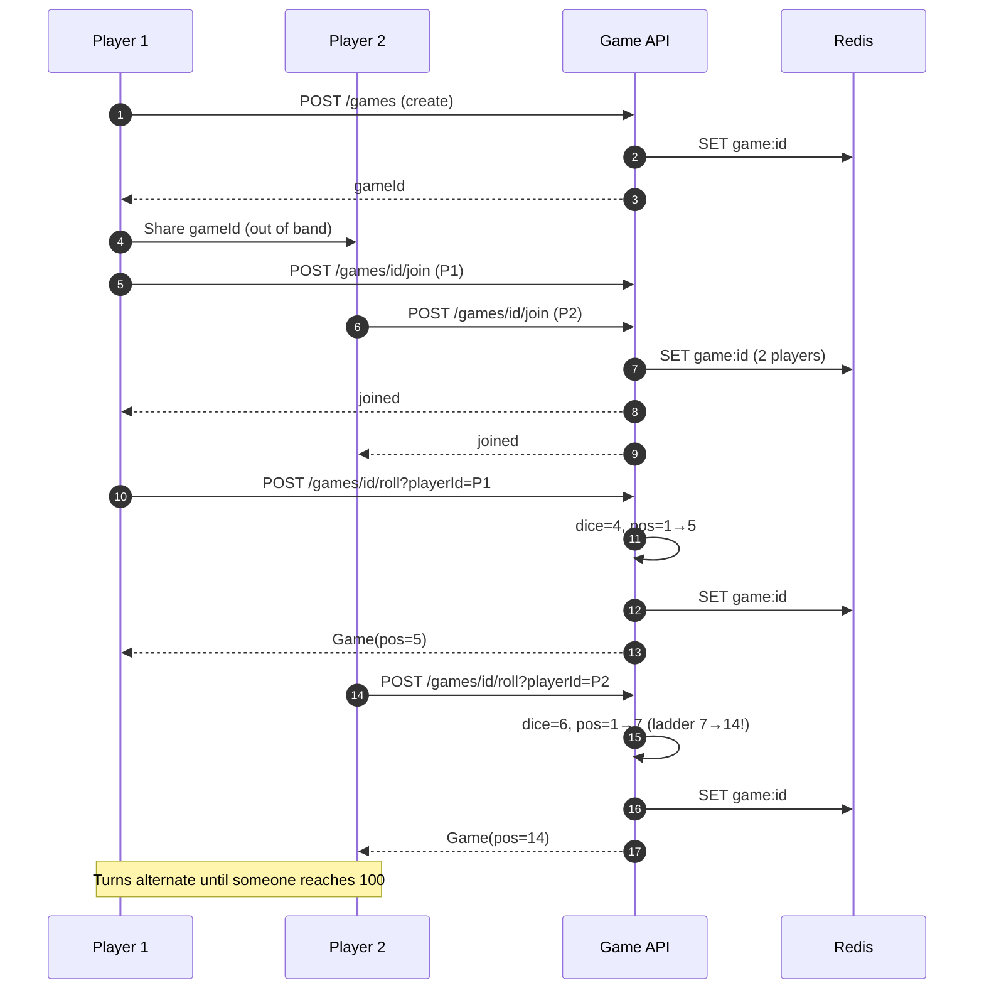

# Snake & Ladder - API Flow & Step-by-Step Guide

## API Endpoints

| Method | Endpoint | Description |
|--------|----------|-------------|
| POST | `/api/games` | Create new game |
| POST | `/api/games/{gameId}/join` | Join existing game |
| POST | `/api/games/{gameId}/roll` | Roll dice (your turn) |
| GET | `/api/games/{gameId}` | Get game state |

## Request Flow - Step by Step

### Flow 1: Create Game

```
Step 1: Client → POST /api/games?maxPlayers=4
Step 2: GameController.create() 
Step 3: GameService.createGame(4)
  ├─ Generate gameId = UUID
  ├─ Create Game(players=[], turn=0, status=WAITING)
  ├─ Redis SET game:{id} = JSON, TTL=1h
  └─ Return {"gameId": "uuid", "status": "WAITING"}
Step 4: Client receives gameId for sharing
```

### Flow 2: Join Game

```
Step 1: Client → POST /api/games/{gameId}/join?playerId=p1&playerName=Alice
Step 2: GameController.join()
Step 3: GameService.joinGame()
  ├─ Redis GET game:{gameId}
  ├─ If not found → 404
  ├─ Check: players.size() < maxPlayers?
  ├─ Check: status == WAITING?
  ├─ Add Player(p1, Alice, position=1)
  ├─ If players >= 2 → status = PLAYING
  ├─ Redis SET game:{id} (update)
  └─ Return {"status": "joined", "players": 2}
Step 4: (Future) Pub/Sub broadcast to other players
```

### Flow 3: Roll Dice

```
Step 1: Client → POST /api/games/{gameId}/roll?playerId=p1
Step 2: GameController.roll()
Step 3: GameService.rollDice()
  ├─ Redis GET game:{gameId}
  ├─ Verify: status == PLAYING
  ├─ Verify: current player's turn (turnIndex % players.size)
  ├─ Roll: dice = random(1-6)
  ├─ newPos = min(100, currentPos + dice)
  ├─ Apply snakes/ladders: newPos = Game.applySnakesAndLadders(newPos)
  ├─ Update player position in list
  ├─ If newPos >= 100 → status=FINISHED, winner=playerId
  ├─ Else → turnIndex++
  ├─ Redis SET game:{id} (update)
  └─ Return updated Game
Step 4: Client receives new state
```

### Flow 4: Get Game State

```
Step 1: Client → GET /api/games/{gameId}
Step 2: GameService.getGame()
  ├─ Redis GET game:{gameId}
  └─ Return Game or 404
```

## Complete Flow Diagram - Full Game



## Snakes & Ladders Board

```
Ladders: 2→38, 7→14, 8→31, 15→26, 21→42, 28→84, 36→44, 51→67, 71→91, 78→98
Snakes:  16→6, 46→25, 49→11, 62→19, 64→60, 74→53, 89→68, 92→88, 95→75, 99→80
```

## Error Responses

| Condition | HTTP | Response |
|-----------|------|----------|
| Game not found | 404 | - |
| Game full | 409 | {"error": "Cannot join"} |
| Not your turn | 403 | - |
| Game not in PLAYING | - | 404 |

## Game State JSON

```json
{
  "id": "uuid",
  "players": [
    {"id": "p1", "name": "Alice", "position": 45},
    {"id": "p2", "name": "Bob", "position": 38}
  ],
  "currentTurn": 3,
  "status": "PLAYING",
  "winnerId": null,
  "createdAt": 1739000000000
}
```
