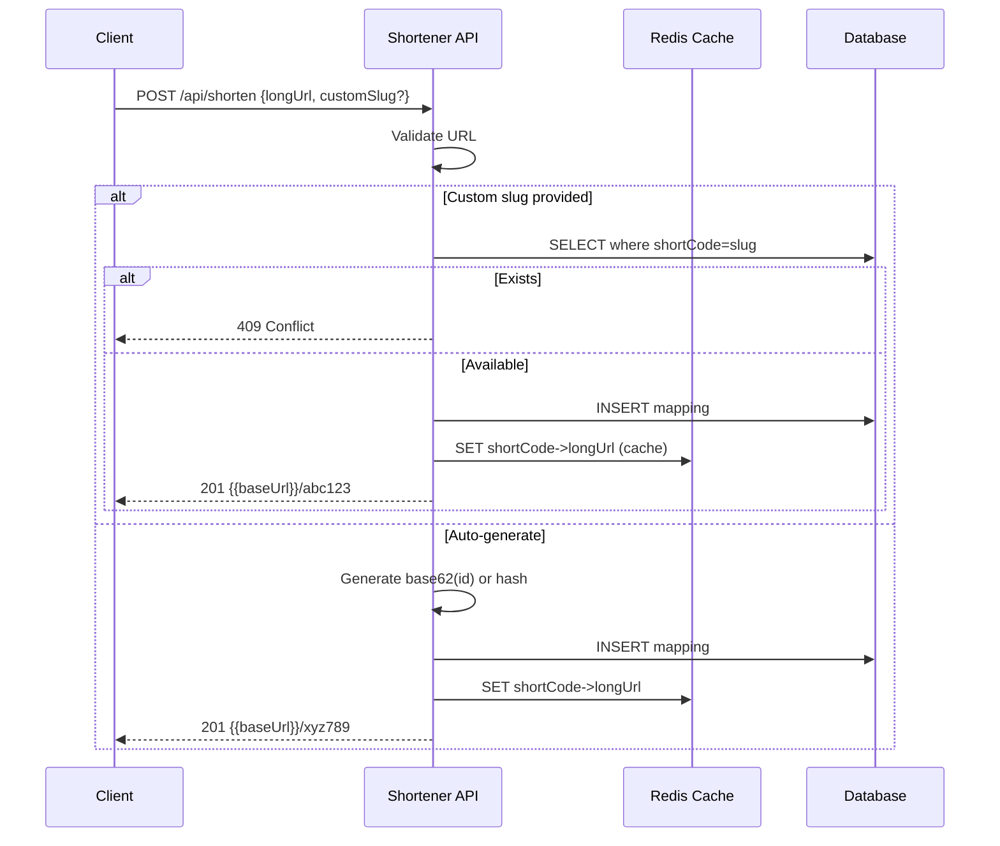
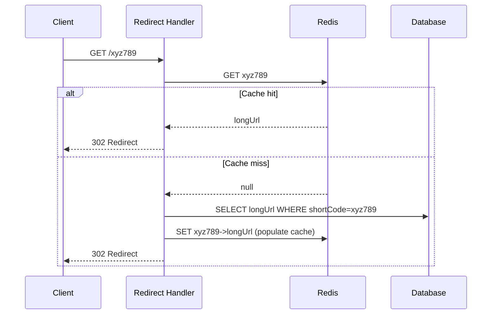

# URL Shortener - API Flow & Step-by-Step Guide

## API Endpoints (Design)

| Method | Endpoint | Description |
|--------|----------|-------------|
| POST | `/api/shorten` | Create short URL |
| GET | `/{shortCode}` | Redirect to long URL |

## Request Flow - Create Short URL

## Request Flow - Redirect

## Step-by-Step Summary

| Step | Create | Redirect |
|------|--------|----------|
| 1 | Validate long URL | Extract shortCode from path |
| 2 | Check custom slug availability | Redis GET shortCode |
| 3 | Generate or use slug | Cache miss → DB lookup |
| 4 | DB INSERT | Populate Redis cache |
| 5 | Redis SET (write-through) | 302 Location: longUrl |
| 6 | Return short URL | - |
